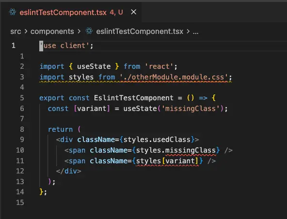

# eslint-plugin-css-modules-next

ESLint plugin for CSS Modules validation. Catches undefined and unused CSS classes, enforces co-location conventions, and disallows dynamic class access patterns that cannot be statically verified.

Supports `.css`, `.scss`, and `.less` module files.

## Motivation

This plugin is inspired by [eslint-plugin-css-modules](https://github.com/atfzl/eslint-plugin-css-modules). That project is no longer maintained and has a number of unresolved issues. `eslint-plugin-css-modules-next` aims to provide the same core functionality while fixing many of the issues that existed with the original plugin.

## Capabilities

**ESLint v9 and v10**
Uses flat config format and is fully compatible with ESLint v9 and v10.

**Pseudo-class selectors**
Classes referenced inside `:not()`, `:where()`, `:is()`, and `:has()` are correctly treated as local class names. A pattern like `.root { &:not(.selected) { } }` makes `.selected` a valid defined class — `styles.selected` will not produce a false positive. Classes inside `:global()` are correctly excluded since they belong to the global scope.

**Nested classes**
Classes defined in nested rules are each tracked as independent local class names, whether the nesting is CSS-native (`.card { .header { } }`) or a compound selector (`.card .header { }`). Both produce `card` and `header` as defined classes. SCSS and LESS nesting are handled equivalently.

**`import * as styles` syntax**
`import * as styles from './Foo.module.css'` works identically to `import styles from './Foo.module.css'`. All rules apply equally to both forms.

**`@keyframes` blocks**
Animation names in `@keyframes` are never treated as CSS class names. A stylesheet that defines `@keyframes spin { }` and uses `animation: spin 1s infinite` will not report `spin` as a defined or unused class.

## Installation

```sh
npm install --save-dev eslint-plugin-css-modules-next
# or
pnpm add -D eslint-plugin-css-modules-next
# or
yarn add --dev eslint-plugin-css-modules-next
```

## Usage

### Recommended config (flat config)

```js
// eslint.config.js
import cssModules from 'eslint-plugin-css-modules-next';

export default [
  cssModules.configs.recommended,
];
```

The recommended config enables all four rules with the following severity:

| Rule | Severity |
|------|----------|
| `css-modules-next/invalid-css-module-filepath` | error |
| `css-modules-next/no-dynamic-class-access` | error |
| `css-modules-next/no-undefined-class` | error |
| `css-modules-next/no-unused-class` | error |

### Manual config

```js
// eslint.config.js
import cssModules from 'eslint-plugin-css-modules-next';

export default [
  {
    plugins: { 'css-modules-next': cssModules },
    rules: {
      'css-modules-next/invalid-css-module-filepath': 'error',
      'css-modules-next/no-dynamic-class-access': 'error',
      'css-modules-next/no-undefined-class': 'error',
      'css-modules-next/no-unused-class': 'error',
    },
  },
];
```

## Rules

Errors are surfaced inline in your editor when using the ESLint Extension:



### `css-modules-next/no-undefined-class`

**Severity in recommended:** `error`

Reports when a CSS class is accessed via dot notation on a CSS module import but that class is not defined in the corresponding CSS file. Prevents runtime `undefined` values caused by typos or stale references.

```css
/* Button.module.css */
.container { }
.label { }
```

```tsx
import styles from './Button.module.css';

<div className={styles.container} />  // OK
<div className={styles.missing} />    // Error: 'missing' is not defined in Button.module.css
```

---

### `css-modules-next/no-unused-class`

**Severity in recommended:** `error`

Reports CSS classes that are defined in a CSS module file but never referenced in the importing TypeScript/JavaScript file. Helps keep CSS files free of dead code.

```css
/* Button.module.css */
.container { }
.label { }
.deprecated { }
```

```tsx
import styles from './Button.module.css';

<div className={styles.container}>   // OK
  <span className={styles.label} />  // OK
</div>
// Warning: 'deprecated' in Button.module.css is never used in this file
```

---

### `css-modules-next/invalid-css-module-filepath`

**Severity in recommended:** `error`

Enforces that a CSS module file is co-located in the same directory as its importing file and shares the same base name. This keeps stylesheets easy to find and makes the relationship between a component and its styles unambiguous.

```
src/
  Button.tsx
  Button.module.css   <- correct
  Card.module.css     <- wrong base name
  styles/
    Button.module.css <- wrong directory
```

```tsx
// In Button.tsx:
import styles from './Button.module.css';        // OK
import styles from './Card.module.css';          // Error: wrong base name
import styles from '../styles/Button.module.css'; // Error: not co-located
```

**Sharing styles between components**

The co-location rule intentionally prevents a single CSS module from being consumed by multiple files. When common base styles need to be shared — a button reset, a spacing utility, a theme mixin — reach for the `composes` keyword rather than importing from a shared module:

```css
/* shared.css (a plain CSS file, not a module) */
.baseButton {
  padding: 8px 16px;
  border-radius: 4px;
  border: none;
  cursor: pointer;
}
```

```css
/* Button.module.css */
.primary {
  composes: baseButton from './shared.css';
  background: blue;
  color: white;
}

.secondary {
  composes: baseButton from './shared.css';
  background: transparent;
  border: 1px solid blue;
}
```

The shared styles are defined once; each component module composes from them without the plugin needing to track cross-file dependencies.

> **Note:** If you disable `invalid-css-module-filepath` and import the same CSS module into multiple files, the accuracy of `no-unused-class` will degrade. The plugin checks each importing file in isolation — a class that goes unreferenced in one file will be reported as unused even if it is used in another. Co-location is what makes the one-to-one relationship between a CSS module and its consumer reliable enough to enforce unused class detection.

---

### `css-modules-next/no-dynamic-class-access`

**Severity in recommended:** `error`

Disallows computed property access on CSS module imports where the key is not a static literal. This covers variable lookups, function calls, and template literals with interpolations.

Static string literals in bracket notation (`styles['container']`) are allowed — the class name is known at analysis time and can be verified the same way as dot notation.

```tsx
import styles from './Button.module.css';

styles.container          // OK — dot notation
styles['container']       // OK — static string literal
styles[name]              // Error — variable
styles[getClass()]        // Error — function call
styles[`${x}Button`]     // Error — template literal with interpolation
```

**Why dynamic access is banned**

When the property key is a runtime value, there is no way to know which class names will actually be accessed without executing the code. That makes it impossible to verify that the accessed class exists in the CSS file, or to detect which CSS classes are unused. The two core rules of this plugin both rely on being able to enumerate every class access statically.

**Preferred alternative:** use a `switch` statement (or an explicit map) to convert the dynamic value into a known class reference:

```tsx
function getButtonClass(variant: 'primary' | 'secondary' | 'ghost') {
  switch (variant) {
    case 'primary':   return styles.primaryButton;
    case 'secondary': return styles.secondaryButton;
    case 'ghost':     return styles.ghostButton;
  }
}
```

Every branch references a class name that the plugin can verify statically, so typos and stale references are still caught.

## License

MIT
