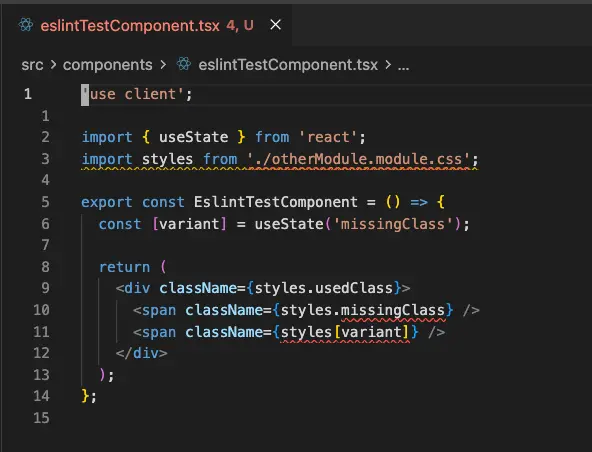

# eslint-plugin-css-modules-next

ESLint plugin for CSS Modules validation. Catches undefined and unused CSS classes, enforces co-location conventions, and disallows dynamic class access patterns that cannot be statically verified.

Supports `.css`, `.scss`, and `.less` module files.

## Motivation

This plugin is inspired by [eslint-plugin-css-modules](https://github.com/atfzl/eslint-plugin-css-modules). That project is no longer maintained and has a number of unresolved issues. `eslint-plugin-css-modules-next` aims to provide the same core functionality while fixing many of the issues that existed with the original plugin.

## Installation

```sh
npm install --save-dev eslint-plugin-css-modules-next
# or
pnpm add -D eslint-plugin-css-modules-next
# or
yarn add --dev eslint-plugin-css-modules-next
```

## Usage

### Recommended config (flat config)

```js
// eslint.config.js
import cssModules from 'eslint-plugin-css-modules-next';

export default [
  cssModules.configs.recommended,
];
```

The recommended config enables all four rules with the following severity:

| Rule | Severity |
|------|----------|
| `css-modules-next/invalid-css-module-filepath` | error |
| `css-modules-next/no-dynamic-class-access` | error |
| `css-modules-next/no-undefined-class` | error |
| `css-modules-next/no-unused-class` | error |

### Manual config

```js
// eslint.config.js
import cssModules from 'eslint-plugin-css-modules-next';

export default [
  {
    plugins: { 'css-modules-next': cssModules },
    rules: {
      'css-modules-next/invalid-css-module-filepath': 'error',
      'css-modules-next/no-dynamic-class-access': 'error',
      'css-modules-next/no-undefined-class': 'error',
      'css-modules-next/no-unused-class': 'error',
    },
  },
];
```

## Rules

Errors are surfaced inline in your editor when using the ESLint Extension:



### `css-modules-next/no-undefined-class`

**Severity in recommended:** `error`

Reports when a CSS class is accessed via dot notation on a CSS module import but that class is not defined in the corresponding CSS file. Prevents runtime `undefined` values caused by typos or stale references.

```css
/* Button.module.css */
.container { }
.label { }
```

```tsx
import styles from './Button.module.css';

<div className={styles.container} />  // OK
<div className={styles.missing} />    // Error: 'missing' is not defined in Button.module.css
```

---

### `css-modules-next/no-unused-class`

**Severity in recommended:** `error`

Reports CSS classes that are defined in a CSS module file but never referenced in the importing TypeScript/JavaScript file. Helps keep CSS files free of dead code.

```css
/* Button.module.css */
.container { }
.label { }
.deprecated { }
```

```tsx
import styles from './Button.module.css';

<div className={styles.container}>   // OK
  <span className={styles.label} />  // OK
</div>
// Warning: 'deprecated' in Button.module.css is never used in this file
```

---

### `css-modules-next/invalid-css-module-filepath`

**Severity in recommended:** `error`

Enforces that a CSS module file is co-located in the same directory as its importing file and shares the same base name. This convention keeps stylesheets discoverable and prevents accidental cross-component style sharing.

```
src/
  Button.tsx
  Button.module.css   <- correct
  Card.module.css     <- wrong base name
  styles/
    Button.module.css <- wrong directory
```

```tsx
// In Button.tsx:
import styles from './Button.module.css';        // OK
import styles from './Card.module.css';          // Error: wrong base name
import styles from '../styles/Button.module.css'; // Error: not co-located
```

---

### `css-modules-next/no-dynamic-class-access`

**Severity in recommended:** `error`

Disallows dynamic (non-literal) computed property access on CSS module imports. Dynamic access prevents static analysis — neither `no-undefined-class` nor `no-unused-class` can verify classes accessed this way.

Static string literals (`styles['container']`) are allowed since they are statically verifiable.

```tsx
import styles from './Button.module.css';

styles.container          // OK — named access
styles['container']       // OK — static string literal
styles[name]              // Error — dynamic variable
styles[getClass()]        // Error — dynamic call
styles[`${x}Button`]     // Error — dynamic template literal
```

**Preferred alternative:** map dynamic values to specific class names statically:

```tsx
function getButtonClass(size: 'small' | 'large') {
  switch (size) {
    case 'small': return styles.smallButton;
    case 'large': return styles.largeButton;
  }
}
```

## License

MIT
